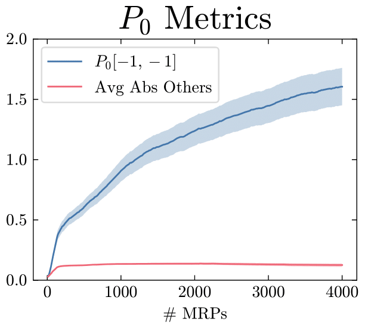
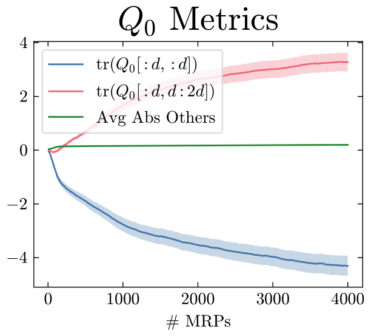
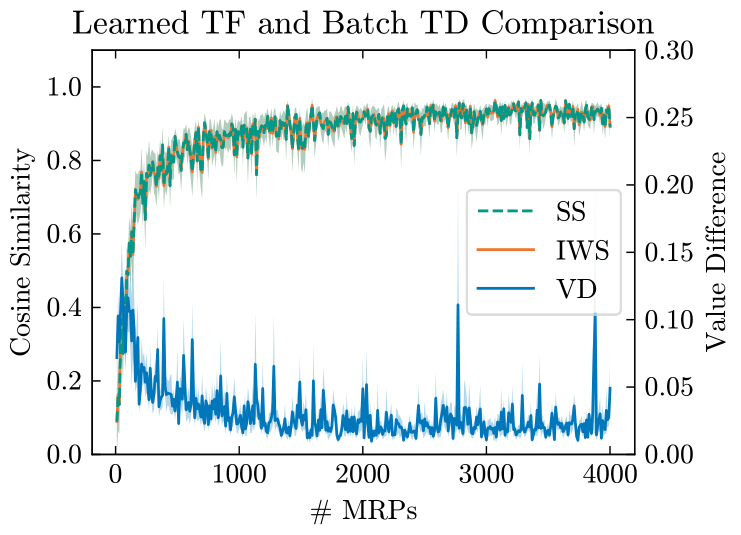

# InContextTD

Welcome to the InContextTD repository, which accompanies the paper: [Transformers Learn Temporal Difference Methods for In-Context Reinforcement Learning](https://arxiv.org/abs/2405.13861).

## Table of Contents
- [Introduction](#introduction)
- [Dependencies](#dependencies)
- [Usage](#usage)
  - [Quick Start](#quick-start)
  - [Custom Experiments](#custom-experiment-settings)
  - [Complete Replication](#complete-replication)
- [License](#license)

## Introduction
This repository provides the code to empirically demonstrate how transformers can learn to implement temporal difference (TD) methods for in-context policy evaluation. The experiments explore transformers' ability to apply TD learning during inference without requiring parameter updates.

## Dependencies
To install the required dependencies, first clone this repository, then run the following command on the root directory of the project:
```bash
pip install .
```

## Usage

### Quick Start
To quickly replicate the experiments from Figure 2 of the paper, execute the following command:
```bash
python main.py --suffix=linear_standard -v
```
This will generate the following plots:
<p align="center">
  
  
  
  
</p>
The generated figures will be saved in:

- `./logs/YYYY-MM-DD-HH-MM-SS/linear_standard/averaged_figures/` (aggregated results across all seeds)

- `./logs/YYYY-MM-DD-HH-MM-SS/linear_standard/seed_SEED/figures/` (diagnostic figures for each individual seed)

### Custom Experiment Settings
To run experiments with custom configurations, use:
```bash
python main.py [options]
```
Below is a list of the command-line arguments available for `main.py`:

- `-d`, `--dim_feature`: Feature dimension (default: 4)
- `-s`, `--num_states`: Number of states (default: 10)
- `-n`, `--context_length`: Context length (default: 30)
- `-l`, `--num_layers`: Number of transformer layers (default: 3)
- `--gamma`: Discount factor (default: 0.9)
- `--activation`: Activation function (choices: ['identity', 'softmax', 'relu'])
- `--representable`: Flag to randomly sample a true weight vector that allows the value function to be fully represented by the features
- `--n_mrps`: Number of MRPs used for training (default: 4000)
- `--batch_size`: Mini-batch size (default: 64)
- `--n_batch_per_mrp`: Number of mini-batches sampled per MRP (default: 5)
- `--lr`: Learning rate (default: 0.001)
- `--weight_decay`: Regularization term (default: 1e-6)
- `--log_interval`: Frequency of logging during training (default: 10)
- `--mode`: Training mode auto-regressive or sequential (choices: ['auto', 'sequential'], default: 'auto')
- `--seed`: Random seeds (default: list(range(1, 31)))
- `--save_dir`: Directory to save logs (default: None)
- `--suffix`: Suffix to append to the log save directory (default: None)
- `--gen_gif`: Flag to generate a GIF showing the evolution of weights (under construction)
- `-v`, `--verbose`: Flag to print detailed training progress

If no `--save_dir` is specified, logs will be saved in `./logs/YYYY-MM-DD-HH-MM-SS`. If a `--suffix` is provided, logs will be saved in `./logs/YYYY-MM-DD-HH-MM-SS/SUFFIX`.

### Demo
We have a demo script to demonstrate the performance of the TD algorithm implemented by the linear transformer under our theoretical construction.
The script generates a figure of the mean square value error (MSVE) averaged over the number of randomly generated MRPs against a sequence of increasing context lengths.
Note that we employ fully representable value functions here to make sure the minimum MSVE is zero.

To run the script, use
```bash
python demo.py [options]
```
Below is a list of the command-line arguments available for `demo.py`:

- `-d`, `--dim_feature`: Feature dimension (default: 5)
- `-l`, `--num_layers`: Number of transformer layers/TD updates (default: 15)
- `-smin`, `--min_state_num`: Minimum possible state number of the randomly generated MRP (default: 5)
- `-smax`, `--max_state_num`: Maximum possible state number of the randomly generated MRP (default: 15)
- `--gamma`: Discount factor (default: 0.9)
- `--lr`: learning rate of the implemented in-context TD algorithm (default: 0.2)
- `--n_mrps`: Number of randomly generated MRPs to test on (default: 300)
- `-nmin`, `--min_ctxt_len`: Minimum context length (default: 1)
- `-nmax`, `--max_ctxt_len`: Maximum context length (default: 40)
- `--ctxt_step`: Context length increment step (default: 2)
- `--seed`: Random seed (default: 42)
- `--save_dir`: Directory to save demo results (default: 'logs')

By default, the result is saved to `./logs/demo`.
### Complete Replication
To run all the experiments from the paper in one go, execute the following shell script:
```bash
./run.sh
```

## License
This project is licensed under the MIT License. See the [LICENSE](LICENSE) file for more information.
